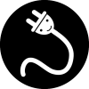

# Denocord
[![Discord][discord-shield]][discord-url]
[![Contributors][contributors-shield]][contributors-url]
[![Forks][forks-shield]][forks-url]
[![Stargazers][stars-shield]][stars-url]
[![Issues][issues-shield]][issues-url]
[![MIT License][license-shield]][license-url]

A fast, strongly typed and versatile Discord API wrapper for the Deno runtime.

# ⚠️ Denocord is in development ⚠️
The public API is currently not documented, and may be subject to change. Proceed with caution. There is no general example for this library. If you'd like to proceed anyway, refer to [bin/test_new_api.ts](./bin/test_new_api.ts) for a bare-bones example.

## Contributing

Refer to the [contributing guidelines](./CONTRIBUTING.md) if you'd like to contribute to Denocord.

## License

Denocord is distributed under the MIT license. See the [`LICENSE`](./LICENSE) file for more information.

## Contact
Join the [official Discord server][discord-url] or [GitHub discussions][gh-discussions] to contact the maintainers of Denocord.

[contributors-shield]: https://img.shields.io/github/contributors/Denocord/Denocord.svg?style=flat
[contributors-url]: https://github.com/Denocord/Denocord/graphs/contributors
[forks-shield]: https://img.shields.io/github/forks/Denocord/Denocord.svg?style=flat
[forks-url]: https://github.com/Denocord/Denocord/network/members
[stars-shield]: https://img.shields.io/github/stars/Denocord/Denocord.svg?style=flat
[stars-url]: https://github.com/Denocord/Denocord/stargazers
[issues-shield]: https://img.shields.io/github/issues/Denocord/Denocord.svg?style=flat
[issues-url]: https://github.com/Denocord/Denocord/issues
[license-shield]: https://img.shields.io/github/Denocord/zorbyte/Denocord.svg?style=flat
[license-url]: https://github.com/Denocord/Denocord/blob/master/LICENSE
[discord-url]: https://discord.gg/gS757SV
[discord-shield]: https://discordapp.com/api/guilds/616556458946854922/embed.png
[gh-discussions]: https://github.com/Denocord/Denocord/discussions
